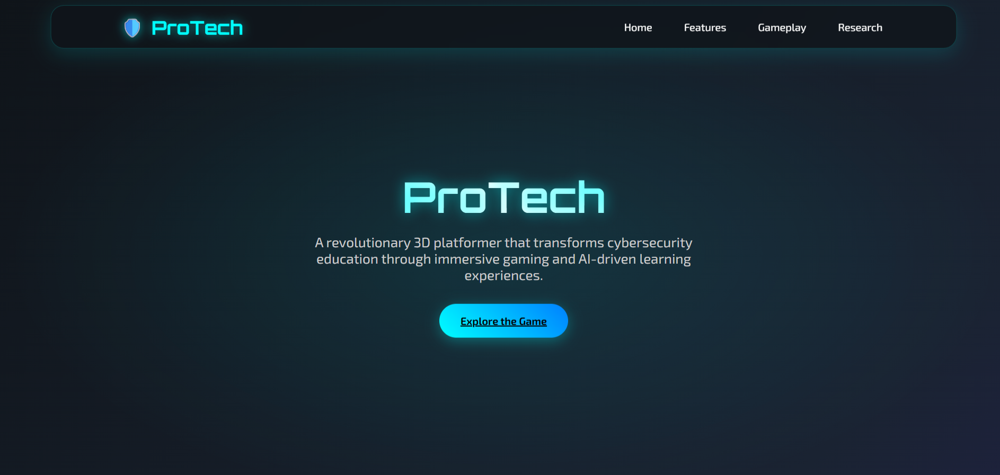
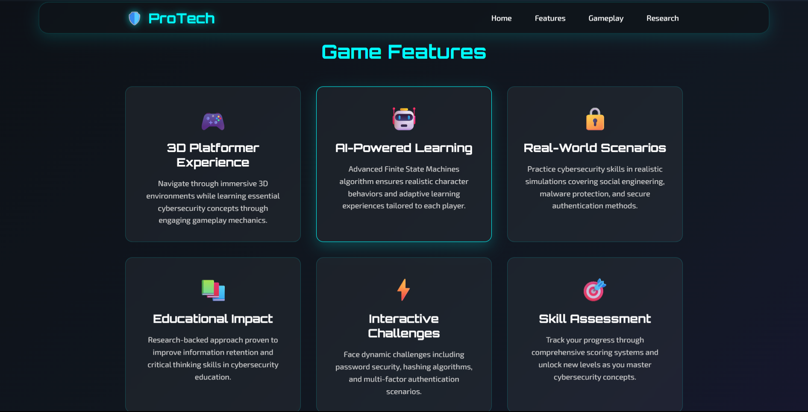
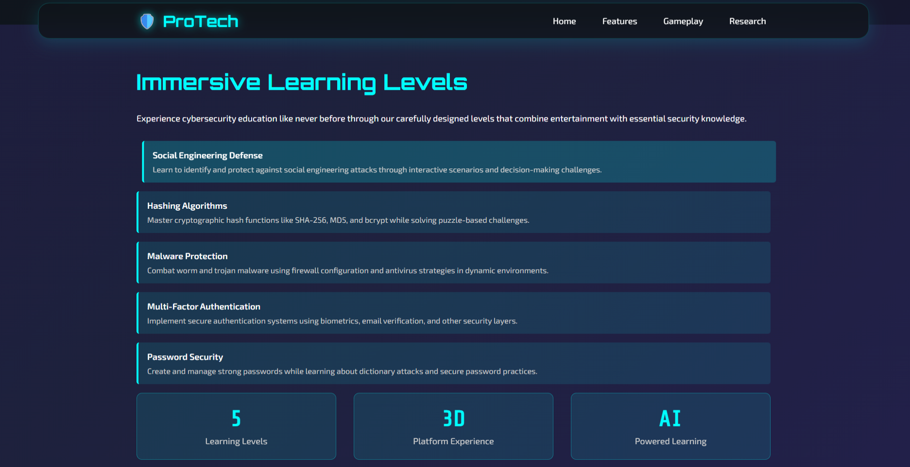
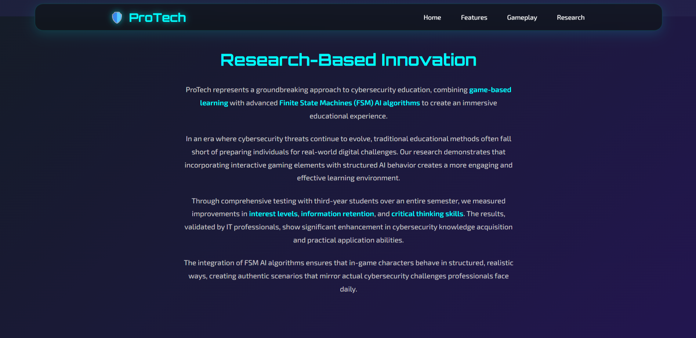

# ProTech  
ProTech-Web is a promotional website for my our project — a 3D Platformer PC Game about Usable Security, which applies Finite State Machines as an A.I. algorithm. The website serves as both an academic presentation and a showcase platform, highlighting the game’s purpose, features, and innovative approach to security concepts.

## Preview  
To see a preview of the website design, check the images below:  
  
  
  
  

These images give you a quick look at the layout and futuristic style of the site.  

## Technologies Used  
- HTML5  
- CSS3  
- JavaScript  

---
© 2025 Arvin Rex Afalla II
